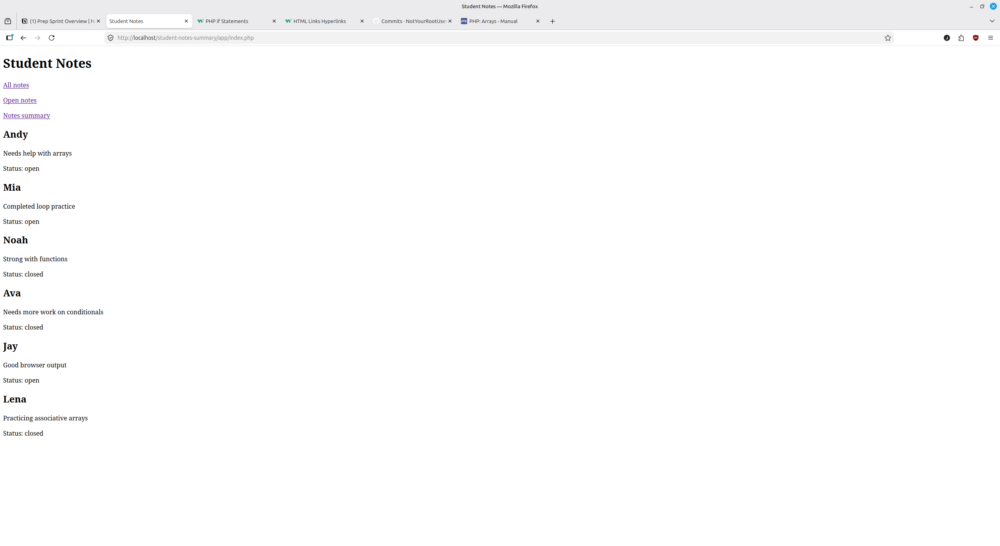
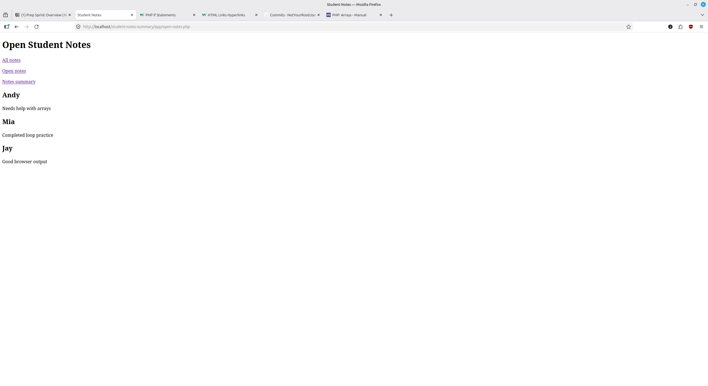
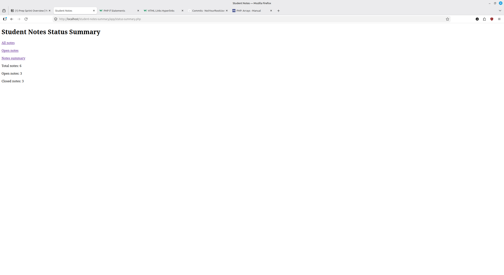

# PHP Student Notes Summary

A small plain PHP practice project built to strengthen core PHP fundamentals such as variables, arrays, associative arrays, loops, functions, conditional logic, and browser output.

## Goal

This project builds a simple multi-page PHP app that:
- shows all student notes
- filters open notes
- shows a status summary

## Purpose

This project was built to practice:
- variables
- arrays
- associative arrays
- loops
- functions
- basic conditional logic
- built-in PHP functions such as `count()`
- PHP syntax differences from JavaScript
- rendering PHP output in the browser
- separating data, logic, and page output into different files

## Features

- View all student notes on one page
- View only open student notes on a filtered page
- View a status summary showing:
  - total notes
  - open notes
  - closed notes
- Use reusable helper functions for filtering and counting
- Navigate between pages with simple links

## Main Files

- `data.php` - stores the student notes array
- `functions.php` - stores reusable helper functions
- `index.php` - shows all notes
- `open-notes.php` - shows only open notes
- `status-summary.php` - shows total, open, and closed note counts

## Project Structure

~~~text
php-student-notes-summary/
├── app/
│   ├── data.php
│   ├── functions.php
│   ├── index.php
│   ├── open-notes.php
│   └── status-summary.php
├── notes/
│   ├── 01-project-overview.md
│   ├── 02-setup-log.md
│   └── 03-what-i-learned.md
├── screenshots/
├── .gitignore
└── README.md
~~~

## How It Works

- `data.php` stores the student note data in an array
- `functions.php` contains helper functions for:
  - getting open notes
  - counting open notes
  - counting closed notes
- `index.php` loops through all notes and displays them
- `open-notes.php` uses a helper function to display only open notes
- `status-summary.php` uses helper functions to display note counts

## How to Run

Run the project locally with PHP or Apache.

Example using PHP's built-in server:

~~~bash
php -S localhost:8000
~~~

Then open:
- `http://localhost:8000/app/index.php`
- `http://localhost:8000/app/open-notes.php`
- `http://localhost:8000/app/status-summary.php`

## Screenshots

### All Notes Page

### Open Notes Page

### Status Summary Page

## Status

Basic project build complete.

Current version includes:
- working all notes page
- working open notes filter page
- working status summary page
- reusable helper functions
- simple navigation links between pages